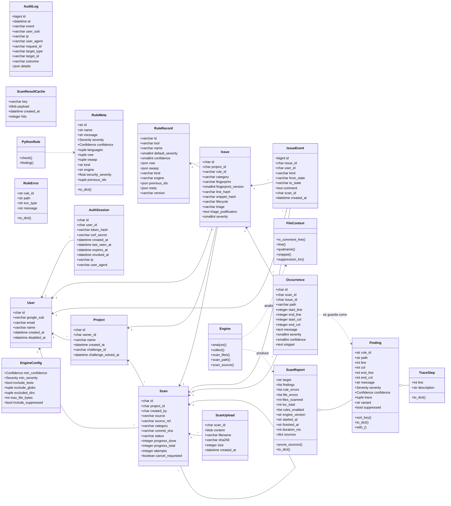

# Diagrama de clases

```mermaid
classDiagram
    direction LR
    class AuditLog {
        +bigint id
        +datetime at
        +varchar event
        +varchar user_sub
        +varchar ip
        +varchar user_agent
        +varchar request_id
        +varchar target_type
        +varchar target_id
        +varchar outcome
        +json details
    }
    class AuthSession {
        +char id
        +char user_id
        +varchar token_hash
        +varchar csrf_secret
        +datetime created_at
        +datetime last_seen_at
        +datetime expires_at
        +datetime revoked_at
        +varchar ip
        +varchar user_agent
    }
    class Issue {
        +char id
        +char project_id
        +varchar rule_id
        +varchar category
        +varchar fingerprint
        +smallint fingerprint_version
        +varchar line_hash
        +varchar snippet_hash
        +varchar lifecycle
        +varchar triage
        +text triage_justification
        +smallint severity
    }
    class IssueEvent {
        +bigint id
        +char issue_id
        +char user_id
        +varchar kind
        +varchar from_state
        +varchar to_state
        +text comment
        +char scan_id
        +datetime created_at
    }
    class Occurrence {
        +char id
        +char scan_id
        +char issue_id
        +varchar path
        +integer start_line
        +integer end_line
        +integer start_col
        +integer end_col
        +text message
        +smallint severity
        +smallint confidence
        +text snippet
    }
    class Project {
        +char id
        +char owner_id
        +varchar name
        +datetime created_at
        +varchar challenge_id
        +datetime challenge_solved_at
    }
    class RuleRecord {
        +varchar id
        +varchar tool
        +varchar name
        +smallint default_severity
        +smallint confidence
        +json cwe
        +json owasp
        +varchar kind
        +varchar engine
        +json previous_ids
        +json meta
        +varchar version
    }
    class Scan {
        +char id
        +char project_id
        +char created_by
        +varchar source
        +varchar source_ref
        +varchar category
        +varchar commit_sha
        +varchar status
        +integer progress_done
        +integer progress_total
        +integer attempts
        +boolean cancel_requested
    }
    class ScanResultCache {
        +varchar key
        +blob payload
        +datetime created_at
        +integer hits
    }
    class ScanUpload {
        +char scan_id
        +blob content
        +varchar filename
        +varchar sha256
        +integer size
        +datetime created_at
    }
    class User {
        +char id
        +varchar google_sub
        +varchar email
        +varchar name
        +datetime created_at
        +datetime disabled_at
    }
    class RuleMeta {
        +str id
        +str name
        +str message
        +Severity severity
        +Confidence confidence
        +tuple languages
        +tuple cwe
        +tuple owasp
        +str kind
        +str engine
        +float security_severity
        +tuple previous_ids
        +to_dict()
    }
    class Finding {
        +str rule_id
        +str path
        +int line
        +int col
        +int end_line
        +int end_col
        +str message
        +Severity severity
        +Confidence confidence
        +tuple trace
        +str variant
        +bool suppressed
        +sort_key()
        +to_dict()
        +with_()
    }
    class TraceStep {
        +int line
        +str description
        +to_dict()
    }
    class RuleError {
        +str rule_id
        +str path
        +str exc_type
        +str message
        +to_dict()
    }
    class PythonRule {
        +check()
        +finding()
    }
    class Engine {
        +analyze()
        +collect()
        +scan_files()
        +scan_path()
        +scan_source()
    }
    class EngineConfig {
        +Confidence min_confidence
        +Severity min_severity
        +bool exclude_tests
        +tuple exclude_globs
        +tuple excluded_dirs
        +int max_file_bytes
        +bool include_suppressed
    }
    class ScanReport {
        +str target
        +list findings
        +list rule_errors
        +list file_errors
        +int files_scanned
        +int loc_total
        +list rules_enabled
        +str engine_version
        +str started_at
        +str finished_at
        +int duration_ms
        +dict sources
        +prune_sources()
        +to_dict()
    }
    class FileContext {
        +is_comment_line()
        +line()
        +qualname()
        +snippet()
        +suppression_for()
    }
    User "1" <-- "*" AuthSession
    Project "1" <-- "*" Issue
    RuleRecord "1" <-- "*" Issue
    Scan "1" <-- "*" Issue
    User "1" <-- "*" Issue
    Issue "1" <-- "*" IssueEvent
    User "1" <-- "*" IssueEvent
    Scan "1" <-- "*" IssueEvent
    Scan "1" <-- "*" Occurrence
    Issue "1" <-- "*" Occurrence
    User "1" <-- "*" Project
    Project "1" <-- "*" Scan
    User "1" <-- "*" Scan
    Scan "1" <-- "*" Scan
    Scan "1" <-- "*" ScanUpload
    Engine ..> FileContext : analiza
    Engine ..> ScanReport : produce
    ScanReport o-- Finding
    Finding o-- TraceStep
    PythonRule ..> RuleMeta
    Occurrence ..> Finding : se guarda como
```
