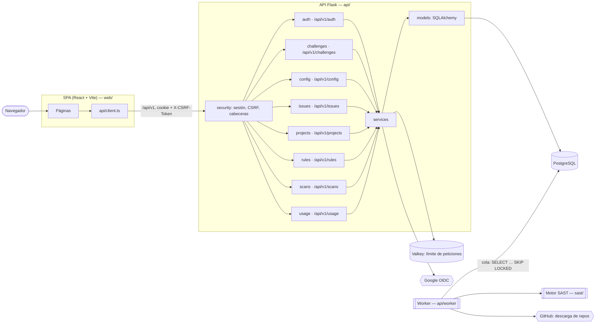

# Diagrama de componentes

```mermaid
flowchart LR
    usuario([Navegador])
    subgraph web["SPA (React + Vite) — web/"]
        paginas[Páginas] --> cliente[api/client.ts]
    end
    subgraph api["API Flask — api/"]
        seguridad[security: sesión, CSRF, cabeceras]
        c_auth["auth · /api/v1/auth"]
        c_challenges["challenges · /api/v1/challenges"]
        c_config["config · /api/v1/config"]
        c_issues["issues · /api/v1/issues"]
        c_projects["projects · /api/v1/projects"]
        c_rules["rules · /api/v1/rules"]
        c_scans["scans · /api/v1/scans"]
        c_usage["usage · /api/v1/usage"]
        servicios[services]
        modelos[models: SQLAlchemy]
    end 
    worker[[Worker — api/worker]]
    motor[[Motor SAST — sast/]]
    db[(PostgreSQL)]
    kv[(Valkey: límite de peticiones)]
    google{{Google OIDC}}
    github{{GitHub: descarga de repos}}
    usuario --> paginas
    cliente -->|"/api/v1, cookie + X-CSRF-Token"| seguridad
    seguridad --> c_auth --> servicios
    seguridad --> c_challenges --> servicios
    seguridad --> c_config --> servicios
    seguridad --> c_issues --> servicios
    seguridad --> c_projects --> servicios
    seguridad --> c_rules --> servicios
    seguridad --> c_scans --> servicios
    seguridad --> c_usage --> servicios
    servicios --> modelos --> db
    servicios --> kv
    servicios --> google
    worker -->|"cola: SELECT … SKIP LOCKED"| db
    worker --> motor
    worker --> github
```
