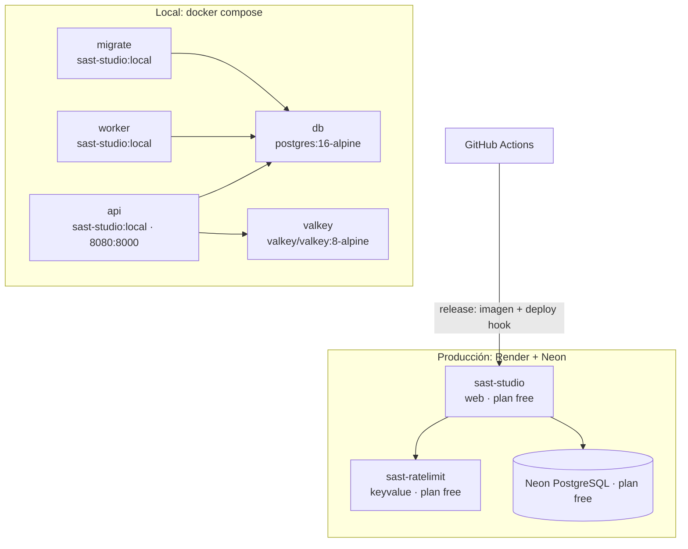

# Diagrama de despliegue

```mermaid
flowchart TB
    subgraph local["Local: docker compose"]
        l_db["db<br/>postgres:16-alpine"]
        l_valkey["valkey<br/>valkey/valkey:8-alpine"]
        l_migrate["migrate<br/>sast-studio:local"]
        l_api["api<br/>sast-studio:local · 8080:8000"]
        l_worker["worker<br/>sast-studio:local"]
    end
    subgraph nube["Producción: Render + Neon"]
        r_sast_studio["sast-studio<br/>web · plan free"]
        r_sast_ratelimit["sast-ratelimit<br/>keyvalue · plan free"]
        neon[(Neon PostgreSQL · plan free)]
    end
    l_api --> l_db
    l_worker --> l_db
    l_api --> l_valkey
    l_migrate --> l_db
    r_sast_studio --> neon
    r_sast_studio --> r_sast_ratelimit
    gh[GitHub Actions] -->|release: imagen + deploy hook| r_sast_studio
```
