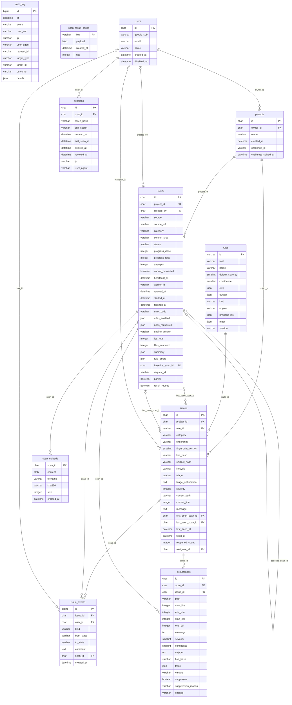

# Diagrama entidad-relación

```mermaid
erDiagram
    audit_log {
        bigint id PK
        datetime at
        varchar event
        varchar user_sub
        varchar ip
        varchar user_agent
        varchar request_id
        varchar target_type
        varchar target_id
        varchar outcome
        json details
    }
    issue_events {
        bigint id PK
        char issue_id FK
        char user_id FK
        varchar kind
        varchar from_state
        varchar to_state
        text comment
        char scan_id FK
        datetime created_at
    }
    issues {
        char id PK
        char project_id FK
        varchar rule_id FK
        varchar category
        varchar fingerprint
        smallint fingerprint_version
        varchar line_hash
        varchar snippet_hash
        varchar lifecycle
        varchar triage
        text triage_justification
        smallint severity
        varchar current_path
        integer current_line
        text message
        char first_seen_scan_id FK
        char last_seen_scan_id FK
        datetime first_seen_at
        datetime fixed_at
        integer reopened_count
        char assignee_id FK
    }
    occurrences {
        char id PK
        char scan_id FK
        char issue_id FK
        varchar path
        integer start_line
        integer end_line
        integer start_col
        integer end_col
        text message
        smallint severity
        smallint confidence
        text snippet
        varchar line_hash
        json trace
        varchar variant
        boolean suppressed
        varchar suppression_reason
        varchar change
    }
    projects {
        char id PK
        char owner_id FK
        varchar name
        datetime created_at
        varchar challenge_id
        datetime challenge_solved_at
    }
    rules {
        varchar id PK
        varchar tool
        varchar name
        smallint default_severity
        smallint confidence
        json cwe
        json owasp
        varchar kind
        varchar engine
        json previous_ids
        json meta
        varchar version
    }
    scan_result_cache {
        varchar key PK
        blob payload
        datetime created_at
        integer hits
    }
    scan_uploads {
        char scan_id PK
        blob content
        varchar filename
        varchar sha256
        integer size
        datetime created_at
    }
    scans {
        char id PK
        char project_id FK
        char created_by FK
        varchar source
        varchar source_ref
        varchar category
        varchar commit_sha
        varchar status
        integer progress_done
        integer progress_total
        integer attempts
        boolean cancel_requested
        datetime heartbeat_at
        varchar worker_id
        datetime queued_at
        datetime started_at
        datetime finished_at
        varchar error_code
        json rules_enabled
        json rules_requested
        varchar engine_version
        integer loc_total
        integer files_scanned
        json summary
        json rule_errors
        char baseline_scan_id FK
        varchar request_id
        boolean partial
        boolean result_reused
    }
    sessions {
        char id PK
        char user_id FK
        varchar token_hash
        varchar csrf_secret
        datetime created_at
        datetime last_seen_at
        datetime expires_at
        datetime revoked_at
        varchar ip
        varchar user_agent
    }
    users {
        char id PK
        varchar google_sub
        varchar email
        varchar name
        datetime created_at
        datetime disabled_at
    }
    issues ||--o{ issue_events : "issue_id"
    issues ||--o{ occurrences : "issue_id"
    projects ||--o{ issues : "project_id"
    projects ||--o{ scans : "project_id"
    rules ||--o{ issues : "rule_id"
    scans |o--o{ issue_events : "scan_id"
    scans |o--o{ issues : "first_seen_scan_id"
    scans |o--o{ issues : "last_seen_scan_id"
    scans |o--o{ scans : "baseline_scan_id"
    scans ||--o{ occurrences : "scan_id"
    scans ||--o{ scan_uploads : "scan_id"
    users |o--o{ issue_events : "user_id"
    users |o--o{ issues : "assignee_id"
    users |o--o{ scans : "created_by"
    users ||--o{ projects : "owner_id"
    users ||--o{ sessions : "user_id"
```
